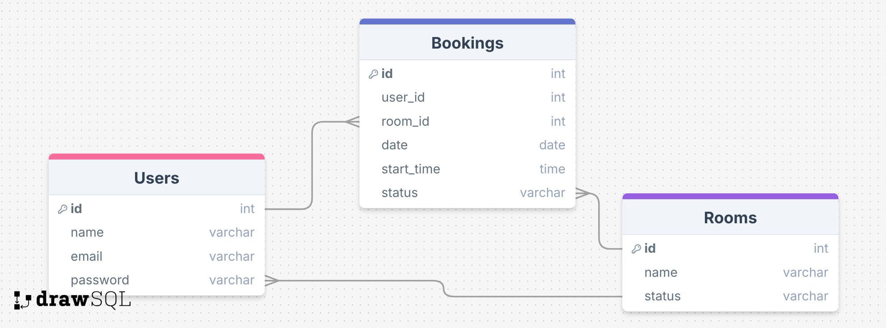
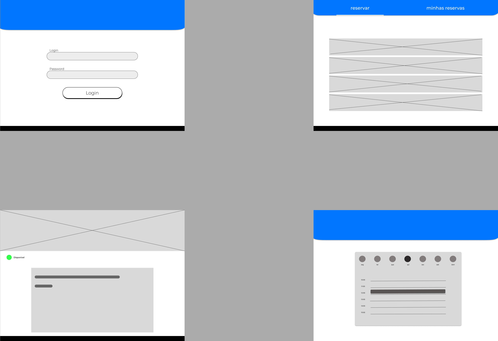
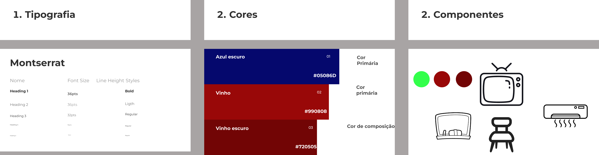
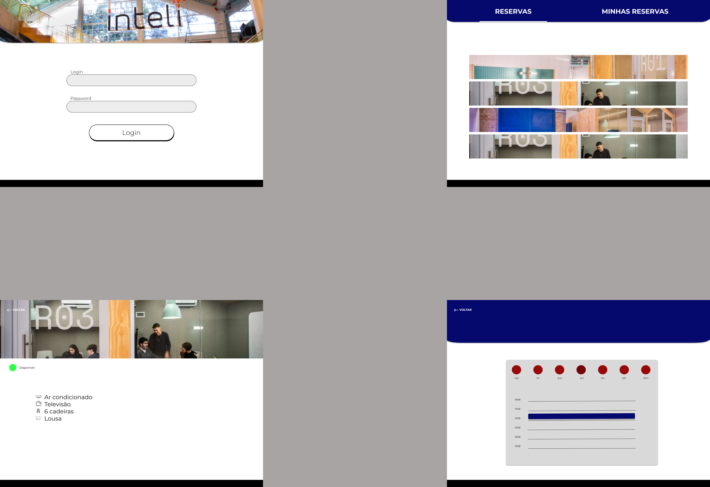

# Web Application Document - Projeto Individual - Módulo 2 - Inteli

## Nome do Projeto
ReservaInteli

#### Autor do projeto
Sophia Hochman

## Sumário

1. [Introdução](#c1)  
2. [Visão Geral da Aplicação Web](#c2)  
3. [Projeto Técnico da Aplicação Web](#c3)  
4. [Desenvolvimento da Aplicação Web](#c4)  
5. [Referências](#c5)  

<br>

## <a name="c1"></a>1. Introdução (Semana 01)

O sistema que será desenvolvido é uma plataforma web de reserva de salas para estudantes do Inteli, com foco na praticidade e na autonomia do usuário. Atualmente, o processo de reserva de salas no Inteli é realizado presencialmente, diretamente na recepção. Esse método, além de consumir tempo, está sujeito a erros humanos e falhas de comunicação, o que frequentemente gera frustrações para alunos e funcionários.

Pensando nisso, o sistema proposto permitirá que os estudantes visualizem a disponibilidade das salas e façam reservas online de forma rápida e prática, seja pelo celular ou computador. A plataforma também enviará confirmações por e-mail e permitirá o cancelamento ou reagendamento das reservas com facilidade.

O objetivo é tornar o processo mais eficiente, transparente e acessível, reduzindo a carga de trabalho da equipe da recepção e melhorando a experiência dos alunos no uso dos espaços compartilhados da faculdade. A interface será simples, intuitiva e otimizada para dispositivos móveis, considerando os hábitos digitais dos estudantes do Inteli.

---

## <a name="c2"></a>2. Visão Geral da Aplicação Web

### 2.1. Personas (Semana 01)

<div align="center">

 </div>


### 2.2. User Stories (Semana 01)


\# | User Stories 
--- | ---
US01 | Como estudante do Inteli, quero visualizar a disponibilidade das salas, para que eu possa escolher um horário livre com facilidade.
US02 | Como estudante do Inteli, quero reservar uma sala diretamente pelo sistema, para não precisar ir até a recepção.
US03 | Como estudante do Inteli, quero poder cancelar ou alterar uma reserva feita, para que eu não ocupe a sala caso meus planos mudem.
US04 | Como estudante do Inteli, quero poder favoritar salas que eu uso com frequência, para agilizar minhas próximas reservas.


US02 | Como estudante da Inteli, quero reservar uma sala diretamente pelo sistema, para tornar o processo mais rápido e autônomo.(Prioritária)

I – Independente: Funciona sozinha, desde que as salas estejam cadastradas no sistema.

N – Negociável: A forma de reserva pode ser adaptada (com ou sem login, com seleção por dia ou por grade semanal, etc).

V – Valiosa: Resolve o maior incômodo atual — a dependência da recepção para fazer reservas.

E – Estimável: A equipe consegue estimar o esforço com base em sistemas similares e frameworks usados.

S – Small: Pode ser desenvolvida como uma funcionalidade bem focada (preencher e enviar reserva).

T – Testável: Pode ser testada simulando uma reserva e verificando a resposta do sistema.

---

## <a name="c3"></a>3. Projeto da Aplicação Web

### 3.1. Modelagem do banco de dados  (Semana 3)
```

CREATE TABLE users (
  id SERIAL PRIMARY KEY,
  name VARCHAR NOT NULL,
  email VARCHAR UNIQUE NOT NULL,
  password VARCHAR NOT NULL
);

CREATE TABLE rooms (
  id SERIAL PRIMARY KEY,
  name VARCHAR NOT NULL,
  status VARCHAR NOT NULL
);

CREATE TABLE bookings (
  id SERIAL PRIMARY KEY,
  user_id INTEGER REFERENCES users(id) ON DELETE CASCADE,
  room_id INTEGER REFERENCES rooms(id) ON DELETE CASCADE,
  date DATE NOT NULL,
  start_time TIME NOT NULL,
  status VARCHAR NOT NULL
);

```

<div align="center">
  <br>
</div>


### 3.1.1 BD e Models (Semana 5)
Os Models do sistema foram desenvolvidos seguindo a arquitetura MVC (Model-View-Controller), e estão localizados na pasta models/ do projeto. Esses modelos representam as entidades principais do sistema de reserva de salas da instituição e são responsáveis pela comunicação com o banco de dados, estruturado em PostgreSQL.
Cada model define a estrutura das tabelas do banco de dados, incluindo os campos, tipos de dados e relacionamentos entre entidades. A seguir, uma breve descrição dos principais modelos implementados:

Usuário (User): representa os usuários do sistema, contendo informações como nome, e-mail, matrícula e tipo de perfil (ex: aluno, professor, administrador).

Sala (Room): define os dados das salas disponíveis para reserva, incluindo nome da sala, localização e capacidade.

Reserva (Booking): registra as reservas feitas pelos usuários, contendo dados como data, horário, sala reservada e usuário responsável.

Esses modelos permitem realizar operações como criação, leitura, atualização e exclusão (CRUD) diretamente no banco de dados, garantindo a integridade das informações e o bom funcionamento da aplicação. A estrutura modular também facilita futuras expansões e manutenções no sistema.


### 3.2. Arquitetura (Semana 5)

<div align="center">
  <br>
</div>

  
*Adicione as setas e explicações sobre como os dados fluem entre o Model, Controller e View.*

### 3.3. Wireframes (Semana 03)

<div align="center">
  <br>
</div>

https://www.figma.com/design/yMx8z6V90azeO57Mc6PmDy/Untitled?node-id=0-1&t=TvFh0XZwV5sfasTy-1 

### 3.4. Guia de estilos (Semana 05)

<div align="center">
  <br>
</div>

https://www.figma.com/design/yMx8z6V90azeO57Mc6PmDy/Untitled?node-id=41-91&p=f&t=NXb8NO7se3D6uT0F-0


### 3.5. Protótipo de alta fidelidade (Semana 05)

<div align="center">
  <br>
</div>

https://www.figma.com/design/yMx8z6V90azeO57Mc6PmDy/Untitled?node-id=1-2&p=f&t=NXb8NO7se3D6uT0F-0 

### 3.6. WebAPI e endpoints (Semana 05)

O sistema implementa uma WebAPI utilizando Node.js com Express, permitindo a interação entre o front-end e o banco de dados por meio de requisições HTTP. Essa API é responsável por gerenciar recursos como usuários, salas e reservas.

A seguir, estão descritos os principais endpoints disponíveis no sistema:

Endpoints de Usuário
GET /usuarios – Retorna a lista de todos os usuários cadastrados.

GET /usuarios/:id – Retorna os dados de um usuário específico.

POST /usuarios – Cadastra um novo usuário.

PUT /usuarios/:id – Atualiza os dados de um usuário.

DELETE /usuarios/:id – Remove um usuário do sistema.

Endpoints de Sala
GET /salas – Lista todas as salas disponíveis.

GET /salas/:id – Exibe os detalhes de uma sala específica.

POST /salas – Cadastra uma nova sala.

PUT /salas/:id – Atualiza as informações de uma sala.

DELETE /salas/:id – Remove uma sala do sistema.

Endpoints de Reserva
GET /reservas – Lista todas as reservas realizadas.

GET /reservas/:id – Mostra os detalhes de uma reserva específica.

POST /reservas – Cria uma nova reserva de sala.

PUT /reservas/:id – Altera uma reserva existente.

DELETE /reservas/:id – Cancela uma reserva.

Endpoints de Horários (opcional, se implementado)
GET /horarios – Lista os horários disponíveis para reserva.

POST /horarios – Adiciona um novo intervalo de horário.

### 3.7 Interface e Navegação (Semana 07)

Desenvolvimento do frontend:
A interface foi criada com EJS e Bootstrap nas seguintes páginas principais:

Página inicial: mostra lista de salas disponíveis e botão para nova reserva.

Formulário de reserva: permite selecionar sala, data e horário; exibe feedback ao usuário (sucesso ou erro de conflito).

Listagem de reservas: exibe reservas do usuário com opção de exclusão ou edição.

Navegação:

Um menu fixo no topo permite acessar a página principal e a página de reservas.

Os botões possuem feedback visual via classes do Bootstrap (btn-success, btn-danger).

Todos os formulários seguem um template consistente e responsivo, já testado em celular (visualização adequada em tela pequena).

## <a name="c4"></a>4. Desenvolvimento da Aplicação Web (Semana 8)

### 4.1 Demonstração do Sistema Web (Semana 8)

##### Vídeo nos assets
(Não consegui adicionar o vídeo aqui pelo fato de ser muito grande, por favor ir nos assets e baixa-lo)

Descrição do conteúdo do vídeo:

- Demonstração da tela de login
- Demonstração da página inicial com lista de salas.
- Fluxo completo: criar uma reserva com feedback de sucesso

### 4.2 Conclusões e Trabalhos Futuros (Semana 8)

 Pontos fortes:

- Sistema funcional com operações CRUD completas.
- Interface organizada, responsiva e de fácil navegação.
- Arquitetura limpa (MVC) favorecendo manutenção e escalabilidade.
- Tratamento de conflitos de horário com validações eficazes no back-end.

  Desafios enfrentados:

- Primeira experiência com Express.js e estruturação por controllers.
- Implementação de lógica para detectar reservas em horários já ocupados (uso de SELECT com WHERE date = … AND start_time = …).
- Estabelecer integração entre form, fetch e resposta ao usuário com mensagens claras.

 Melhorias futuras:

- Autenticação de usuários: login + níveis de acesso (aluno, admin).
- Notificações via e-mail: confirmação e lembrete de reserva.
- Feedback de erro mais detalhado: mensagens específicas no front-end.
- Reservas recorrentes: possibilidade de agendar eventos semanais/mensais.
- Visualização avançada: grade semanal de horários disponíveis.
- Exportação de reservas: geração de relatórios em PDF ou CSV.
- Design aprimorado: melhorar a interface com componentes personalizados ou animações.


## <a name="c5"></a>5. Referências

https://www.inteli.edu.br/
